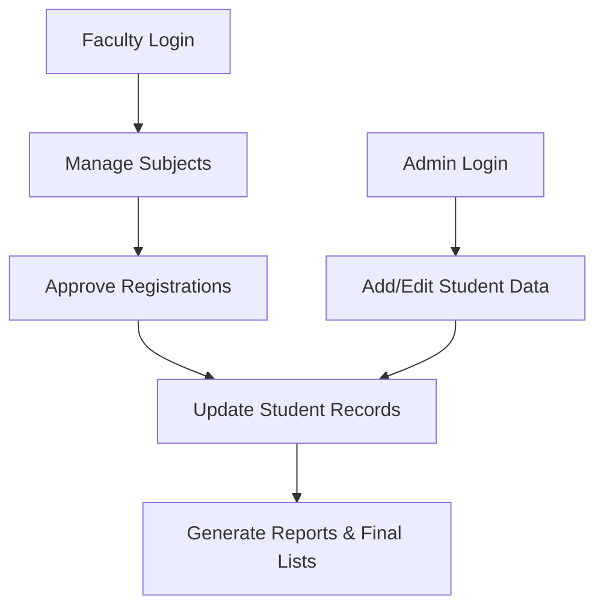

# 🏫 SCOE Data Flow: Student Data & Subject Management Platform

<div align="center">


**Team Innovate X**  
👩‍💻 Project Leader: Lasya and Pranav**

**A Smart Web Platform for Managing Student Data, Subject Registrations, and Final Lists at SCOE**

[](https://opensource.org/licenses/MIT)  
[](https://www.python.org/)  
[](https://www.postgresql.org/)  
[](https://fastapi.tiangolo.com/)  
[](https://developer.mozilla.org/)  

**🏆 Built for Hackathons & Scalable for Institutional Needs**

</div>

---

## 🚨 The Problem: Manual Student & Subject Management  

- Student data spread across multiple systems, prone to errors  
- Manual subject entries = time-consuming and inefficient  
- Difficulty generating consolidated final student lists  
- Security and consistency risks without centralized DB  

---

## 💡 SCOE Data Flow: Our Solution  

**A centralized, PostgreSQL-powered web application that:**
- Stores and manages complete student profiles  
- Handles **subject registration & validation** (capacity + prerequisites)  
- Generates **final consolidated student lists** automatically  
- Provides **role-based access** (Admin, Faculty, Students)  
- Supports data export (CSV, PDF) for reports  

---

## 🔑 Key Features  

- 🎓 **Student Database** – Secure, centralized record storage  
- 📝 **Subject Entry** – Validate prerequisites and capacity  
- 📊 **Final Lists** – Generate by semester, subject, or class  
- 👨‍🏫 **Role-Based Access** – Admin, Faculty, and Student views  
- 📥 **Import/Export** – Easy backups, reports, and analytics  
- 🔒 **Authentication & Security** – Ensures only authorized access  

---

## 🏗️ System Overview  

### Student Journey  
```mermaid
graph TB
  A[Student Entry Form] --> B[Student Database (PostgreSQL)]
  B --> C[Subject Registration]
  C --> D{Capacity & Prerequisite Check}
  D -->|Valid| E[Store in DB]
  D -->|Invalid| F[Error & Retry]
  E --> G[Final Student List]
```


```mermaid
graph LR
  FE[Frontend: HTML, CSS, JavaScript - React optional] --> BE[Backend: Flask/FastAPI (Python)]
  BE --> DB[(PostgreSQL Database)]
  BE --> AUTH[Authentication & Role Management]
  BE --> EXPORT[CSV/PDF Export Engine]
  DEVOPS[Deployment: Docker/Kubernetes Ready] --> BE
```

☁️ Deployment & Scalability
🚀 Dockerized backend for easy deployment
⚡ REST APIs for interoperability with other college systems
☸️ Kubernetes-ready for institutional scaling
🔒 Role-based authentication and database encryption

🔮 Roadmap
📱 Mobile-first student portal
🔔 Email/SMS notifications for subject approvals
📈 Analytics dashboard for student performance trends
🌍 Multi-language interface for inclusivity

🌐 Project Links
📂 GitHub Repository → SCOE Data Flow
🎥 Demo Video → Watch on YouTube

🖼️ Screenshots
🔹 Login & Dashboard
�
🔹 Subject Registration Flow
�
🔹 Final Student List
�
👨‍👩‍👧 Team innovate X
Lasya Korandla
pranav raut
amey kadam
sairaj mote
